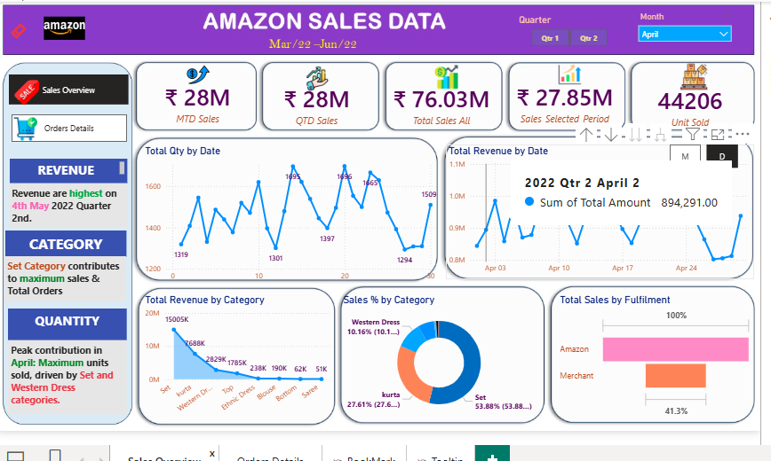
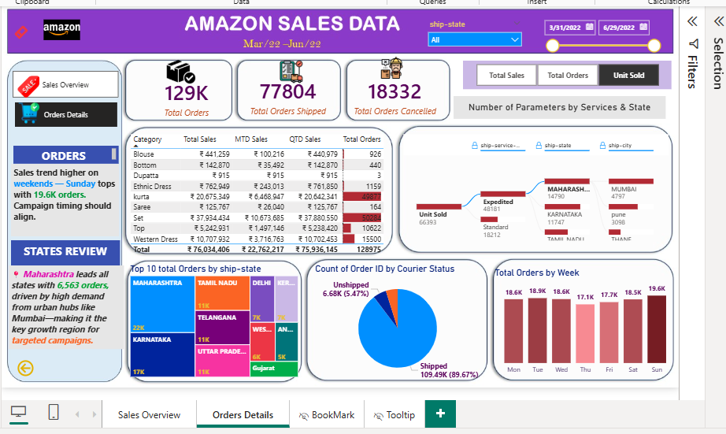

# 🛒 Amazon Sales Data Exploration – India

## 📊 Power BI Dashboard + Data Analysis Project

### 👋 Project Motivation
I explored Amazon sales data to uncover key business insights and built a user-friendly dashboard to help entrepreneurs optimize their sales strategies.

### 📥 Dataset Source
- Found on [Kaggle](https://www.kaggle.com)
- Includes: order details, products, delivery types, location, promotions, earnings

---

## 🧹 Data Cleaning

- Dropped: `Unnamed_22` column (mostly null)
- Converted: `ship_postal_code` to numeric
- Removed: 33 null rows in location fields
- Standardized: `currency = INR`, null `fulfilled_by = 'unknown'`
- Adjusted: set `order_amount = 0` for cancelled orders

---

## 🔍 Exploratory Categories & Insights

### 1️⃣ Delivery

- Fulfilment:
  - 70% orders by Amazon, 30% others
- Ship Service Level:
  - 69% expedited delivery – surprisingly popular
- Order Status:
  - 16% cancellations or non-receipts

### 2️⃣ Items

- Best-selling Categories:
  - Top 20/57 = 80% of sales
  - 3 categories contribute to 90% of sales
- Quantity Analysis:
  - Only 0.3% orders had more than one item
  - Cancellation rate for quantity = 2 is 10% (vs. 6% for 1)

### 3️⃣ Location

- Revealed top-performing cities and states
- Checked for international orders

### 4️⃣ Earnings

- Monthly & weekly sales breakdown
- March has lower volume due to last-day-only data

### 5️⃣ ## 🛍️ Amazon Sales Dashboard Summary (Mar–Jun 2022)

- Total sales: ₹76.03M; peak in Q2 with highest revenue on May 4.
- April had the most units sold, led by Set and Western Dress categories.
- Set category alone contributed over 50% of total sales and orders.
- Single-item purchases were dominant, with quantity = 1 making up 99.7% of orders.
- Amazon was the top fulfillment method, accounting for 100% delivery rate.

## 📈 Dashboard Features

- Dynamic KPIs, charts, slicers for granular insights
- Storytelling layout with user-friendly visuals
- Drill-throughs,Field Parameter,tooltips, bookmarks, and decomposition trees
- Location-based mapping and slicer-driven views

---

## ✅ Project Outcome

This dashboard offers actionable insights for entrepreneurs, highlighting performance drivers, promotional impact, and regional preferences. It demonstrates the power of retail data analytics using Power BI.

---

## 🚀 Next Steps

- ### 📈 Sales Trend

### 📊 Orders Trend

- Link to [Power BI dashboard demo](https://your-thumbnail-link.com)(./assets/Amazon_Sales_Demo.mp4)
- -<video controls width="800">
  <source src="./assets/Amazon_Sales_Demo.mp4" type="video/mp4">
  </video>
- Continue iterating with new datasets and features

---

_Designed and created by Varsha N – Systems Engineer, aspiring Data Analyst specializing in retail analytics and Power BI storytelling._
